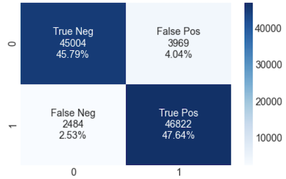

# Predicting The rain phenomena in Saudi Arabia

This repository is made in SDAIA Acadmey bootcamp.

Naif Alorfi

## Abstract

&nbsp;&nbsp;&nbsp;&nbsp; Weather information considered important in many fields such as Aviation, Agriculture, Municipalities and many others. We need water for many reasons and weather controls the distribution of rain water on earth. The aim of this project is to analysis the coorelation of the weather information and use classification models to predict rain Phenomena in Saudi Arabia. First, I preprocessed on ["Saudi Arabia Weather History"](https://www.kaggle.com/esraamadi/saudi-arabia-weather-history) dataset and implement some exploratory data analysis and deal with outliers using Interquartile Range (IQR) and data balncing use SMOTE. Then I have implemented feature scaling. at the end a I have train the dataset with 3 models Logistic Regression and Artificial Neural Network and then random forest classifier.

## Design

&nbsp;&nbsp;&nbsp;&nbsp; This project aims to predict the rain based on other weather elements that hopefully it can help forecasters in the meteorology center and other officals for example Municipalities need the rain forcast to get prepared for any incident that may occur because of the rain Such as flash flood. I understand there is many factors that should be considered when forecasting the weather. This project is based on the dataset available publicly at [Kaggle](https://www.kaggle.com/esraamadi/saudi-arabia-weather-history) website with title "Saudi Arabia Weather History".

## Data

&nbsp;&nbsp;&nbsp;&nbsp; Dataset is contains hourly historical weather data for all Saudi Arabia cities from 2017 to 2019 with 249023 observations and 15 variables for each, 10 Numerical and 5 Categorical variable with object datatype. Unfortunately the data is not described on the website but I have got the information from meteorologist and identified as the following :
| # | Columns | description | | |
|---|---|---|---|---|
| 1 | `Unnamed` : | index. | | |
| 2 | `city` : | City name. | | |
| 3 | `date` : | The date of Observation. | | |
| 4 | `time` : | The time of Observation. | | |
| 5 | `year` : | The year of Observation | | |
| 6 | `month` : | The month of Observation | | |
| 7 | `day` : | The day of Observation | | |
| 8 | `hour` : | The hour of Observation | | |
| 9 | `minute` : | The minute of Observation | | |
| 10 | `weather` : | List of phenomenas. | | |
| 11 | `temp` : | Air Temperature. | | |
| 12 | `wind` : | Wind speed. | | |
| 13 | `humidity` : | The percentage of Humidity | | |
| 14 | `barometer` : |The pressure per barometer | | |
| 15 | `visibility`:| The visibility per KM | | |

&nbsp;&nbsp;&nbsp;&nbsp; In data cleaning I resolve the missing values that can have imputed by means per city. Also I converted datatype to Numerical. Further more,Also the weather column represents the weather phenomena which is in a text format and multiple phenomena merged together. So I have extracted the rain and it's synonyms and placed in a new column `rain` Which will be our target with label 1 rain occure and 0 for otherwise.

## Algorithms

On the notebook I have implemented several algorithms:

**Interquartile Range IQR:** The `wind`, `temp`, `visibility`, `barometer` columns contain outliers. So I used IQR approach to capture maximum and minimum values and remove outliers from the above variables. for example Figure (1) is Illustrating the outliers for the temperature.

**Oversampling "SMOTE":** This approach for addressing imbalanced datasets by oversample the minority class. `rain` was imbalanced with 245696 `False` and 3327 `True` observation. So I got 245696 for each after implementing SMOTE.Figure (2,3) is shows the difference.

**Feature Scaling:** Feature Scaling is implemented before traing the models.

### Modeling

**Logistic Regression:** Firstly, I have trained the model with Logistic Regression with parameters `solver= 'liblinear' , C=1000` and I got the accuracy **89.15 %** in test dataset. Figure (4) shows Confusion matrix.

**Artificial Neural Network (ANN):** Second, I have trained the model with Artificial Neural Network with parameters `batch_size = 3200, epochs = 100` and get the accuracy **93.43 %** in test dataset. Figure (5) shows Confusion matrix.

**RandomForestClassifier:** Lastly, I have trained the model with Logistic Regression with parameters `sn_estimators = 10, criterion = 'entropy', random_state = 42` and get the accuracy **99.61** in test dataset. Figure (6) shows Confusion matrix.

| #   | Figure                                        |                                  |     |     |
| --- | --------------------------------------------- | -------------------------------- | --- | --- |
| 1   | temperature outliers :                        |     |     |     |
| 2   | Imbalanced data :                             |  |     |     |
| 3   | After data balancing :                        |   |     |     |
| 4   | Confusion matrix for Logistic Regression :    |             |     |     |
| 5   | Confusion matrix for ANN :                    |            |     |     |
| 6   | Confusion matrix for RandomForestClassifier : |             |     |     |

## Tools

&nbsp;&nbsp;&nbsp;&nbsp; This project used Jupytur Notebooks on coda environment, Python as programming language and some python libraries, such as `numpy` , `pandas` for mathematical functions, data analysis and manipulation. Also for predictive data analysis it uses `cikit-learn`, `tensorflow` and `SMOTE` for data balancing. For data visualization uses `matplotlib` and `seaborn`.

## Communication

I'm attaching the MS PowerPoint slides to summaries this project journey. I will discuss with the supervisors of this project In order to improve the work.

**Conclusion**
I have cleaned up the dataset by replacing the missing values with mean per city.
In addion, I extracted the `Rain` from the `weather` to form up the target. Further more, I have reseted the outliers to the minimum and maximum values then I have balanced the data with SMOTE and the Feature Scaling is implemented.

Finaly, I have train the traing dataset with three models and got the accuracy, recall, precision and F1-score:

1- `LogisticRegression`.

2- `Artificial Neural Network` (ANN).

3- `RandomForestClassifier`.

It seems that, `RandomForestClassifier` was the best model fit with accuracy score **99.6 %**.
